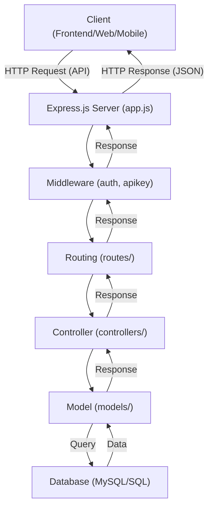
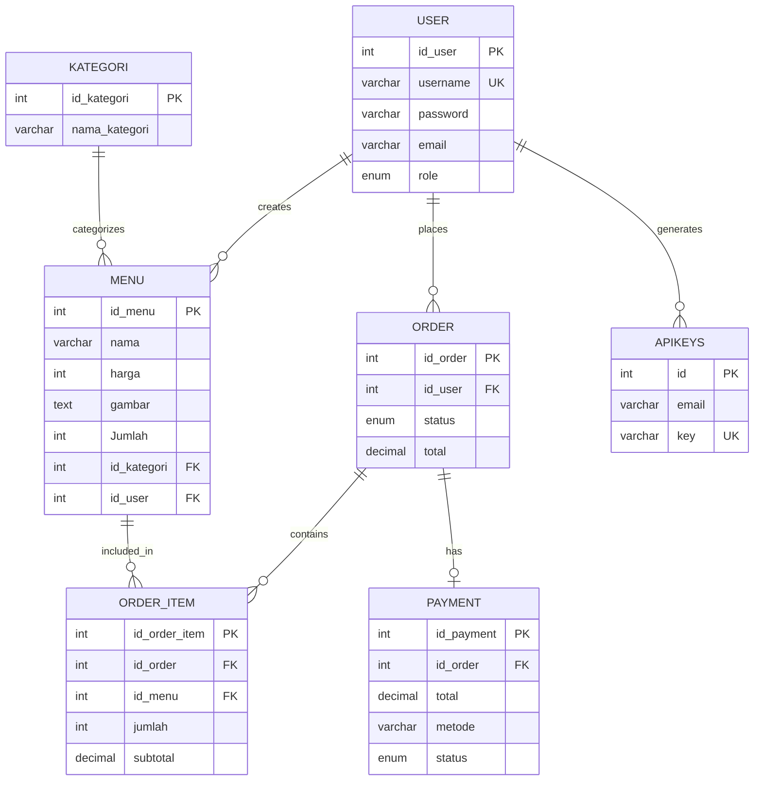

# Sistem Pemesanan Restoran Berbasis API

## Daftar Isi
1. [Pendahuluan](#1-pendahuluan)
2. [Fitur Utama](#2-fitur-utama)
3. [Arsitektur Sistem](#3-arsitektur-sistem)
4. [Setup & Instalasi](#4-setup--instalasi)
5. [Struktur Proyek](#5-struktur-proyek)
6. [Implementasi Database & Relasi](#6-implementasi-database--relasi)
7. [Pengembangan Sistem](#7-pengembangan-sistem)
8. [Cara Penggunaan](#8-cara-penggunaan)
9. [Pengujian Sistem](#9-pengujian-sistem)
10. [Evaluasi Sistem](#10-evaluasi-sistem)
11. [Dokumentasi & Referensi](#11-dokumentasi--referensi)
12. [Troubleshooting](#12-troubleshooting)
13. [Pengembangan Lanjutan](#13-pengembangan-lanjutan)

---

## 1. Pendahuluan
Sistem ini adalah aplikasi pemesanan makanan berbasis web yang terdiri dari backend (API server), frontend (web user & admin), dan database. Backend dibangun dengan Node.js (Express & Sequelize), frontend menggunakan HTML, CSS, dan JavaScript, serta database menggunakan MariaDB/MySQL.

---

## 2. Fitur Utama
- Registrasi & login user (JWT)
- Manajemen menu makanan/minuman (CRUD)
- Kategori menu
- Pemesanan makanan (order & order item)
- Pembayaran (simulasi)
- Dashboard admin (manajemen menu & pesanan)
- API Key management
- Profil user

---

## 3. Arsitektur Sistem
Sistem menggunakan arsitektur **three-tier** (presentation, application, data).
- **Frontend**: HTML, CSS, JS (user & admin)
- **Backend**: Node.js, Express, Sequelize (RESTful API)
- **Database**: MariaDB/MySQL



---

## 4. Setup & Instalasi
### 4.1. Prasyarat
- Node.js (disarankan versi 16+)
- npm (Node Package Manager)
- MariaDB/MySQL Server
- Browser modern (Chrome, Firefox, Edge, dsb.)
- Postman (untuk pengujian API, opsional)

### 4.2. Clone & Struktur Proyek
```bash
git clone <url-repo-anda>
cd uas_api_final
```

---

### 4.3. Setup Database
1. **Buat database baru** di MariaDB/MySQL, misal: `restoran`.
2. **Import skema dan data awal**:
   - Buka phpMyAdmin atau terminal MySQL.
   - Jalankan:
     ```sql
     SOURCE backend/scr/config/restoran.sql;
     ```
3. **Cek tabel**: Pastikan tabel seperti `user`, `menu`, `order`, `order_item`, `payment`, `kategori`, dll. sudah ada.

#### Cara Membuat Tabel Relasi Database (Manual SQL)
Jika ingin membuat tabel secara manual, berikut contoh sintaks SQL untuk relasi utama:

```sql
CREATE TABLE user (
  id_user INT AUTO_INCREMENT PRIMARY KEY,
  username VARCHAR(50) UNIQUE,
  password VARCHAR(255),
  email VARCHAR(100),
  role ENUM('admin','pelanggan') DEFAULT 'pelanggan',
  created_at TIMESTAMP DEFAULT CURRENT_TIMESTAMP,
  updated_at TIMESTAMP DEFAULT CURRENT_TIMESTAMP ON UPDATE CURRENT_TIMESTAMP
);

CREATE TABLE kategori (
  id_kategori INT AUTO_INCREMENT PRIMARY KEY,
  nama_kategori VARCHAR(50),
  created_at TIMESTAMP DEFAULT CURRENT_TIMESTAMP,
  updated_at TIMESTAMP DEFAULT CURRENT_TIMESTAMP
);

CREATE TABLE menu (
  id_menu INT AUTO_INCREMENT PRIMARY KEY,
  nama VARCHAR(100),
  harga INT,
  gambar TEXT,
  Jumlah INT,
  id_kategori INT,
  id_user INT,
  created_at TIMESTAMP DEFAULT CURRENT_TIMESTAMP,
  updated_at TIMESTAMP DEFAULT CURRENT_TIMESTAMP,
  FOREIGN KEY (id_kategori) REFERENCES kategori(id_kategori),
  FOREIGN KEY (id_user) REFERENCES user(id_user)
);

CREATE TABLE `order` (
  id_order INT AUTO_INCREMENT PRIMARY KEY,
  id_user INT,
  status ENUM('pending','diproses','selesai','dibatalkan') DEFAULT 'pending',
  total DECIMAL(10,0) NOT NULL,
  created_at TIMESTAMP DEFAULT CURRENT_TIMESTAMP,
  updated_at TIMESTAMP DEFAULT CURRENT_TIMESTAMP ON UPDATE CURRENT_TIMESTAMP,
  FOREIGN KEY (id_user) REFERENCES user(id_user)
);

CREATE TABLE order_item (
  id_order_item INT AUTO_INCREMENT PRIMARY KEY,
  id_order INT,
  id_menu INT,
  jumlah INT,
  harga_satuan DECIMAL(10,2),
  subtotal DECIMAL(10,2),
  created_at TIMESTAMP DEFAULT CURRENT_TIMESTAMP,
  FOREIGN KEY (id_order) REFERENCES `order`(id_order),
  FOREIGN KEY (id_menu) REFERENCES menu(id_menu)
);

CREATE TABLE payment (
  id_payment INT AUTO_INCREMENT PRIMARY KEY,
  id_order INT,
  total DECIMAL(10,2),
  metode VARCHAR(50),
  customer VARCHAR(255),
  status ENUM('pending','paid','failed') DEFAULT 'pending',
  created_at DATETIME NOT NULL,
  FOREIGN KEY (id_order) REFERENCES `order`(id_order)
);

CREATE TABLE apikeys (
  id INT AUTO_INCREMENT PRIMARY KEY,
  email VARCHAR(100),
  `key` VARCHAR(255) UNIQUE,
  active TINYINT DEFAULT 1,
  created_at DATETIME,
  updated_at DATETIME
);
```

---

### 4.4. Setup Backend
1. Masuk ke folder backend:
   ```bash
   cd backend
   ```
2. Install dependencies:
   ```bash
   npm install
   ```
3. **Konfigurasi koneksi database**:
   - Edit file `backend/scr/config/sequelize.js` sesuai dengan user, password, host, dan nama database Anda.
4. Jalankan server backend:
   ```bash
   node app.js
   ```
   - Server berjalan di port default (misal: 3000). Cek terminal untuk konfirmasi.

---

### 4.5. Setup Frontend
Frontend dapat diakses langsung dengan membuka file HTML di browser, misal:
- Untuk user: `frontend/index/index.html`, `frontend/menu/menu.html`, `frontend/order/order.html`, dsb.
- Untuk admin: `frontend/admin/admin.html`

**Catatan:** Pastikan backend sudah berjalan dan endpoint API dapat diakses dari browser.

---

## 5. Struktur Proyek
```
uas_api_final/
  backend/
    app.js
    package.json
    scr/
      config/
      controllers/
      middleware/
      models/
      routes/
  frontend/
    admin/
    index/
    login/
    menu/
    order/
    profil/
  api/
    dashboard.html
    login.html
    register.html
    styles.css
  *.md (dokumentasi)
```

---

## 6. Implementasi Database & Relasi
### Entity Relationship Diagram (ERD)


---

## 7. Pengembangan Sistem
### 7.1. Backend
- **Struktur folder utama:**
  - `controllers/` : Logika bisnis (auth, menu, order, payment, user, kategori)
  - `models/`      : Definisi model Sequelize (ORM)
  - `routes/`      : Definisi endpoint API
  - `middleware/`  : Middleware autentikasi, API key, dsb.
  - `config/`      : Konfigurasi database & file SQL

- **Menambah Fitur Baru:**
  1. Tambahkan model baru di `models/`
  2. Buat controller di `controllers/`
  3. Tambahkan route di `routes/`
  4. Daftarkan route di `app.js`

- **Menjalankan ulang server:**  
  Setelah perubahan, restart server dengan `node app.js`.

### 7.2. Frontend
- **Struktur folder:**
  - `frontend/index/`   : Halaman utama user
  - `frontend/menu/`    : Daftar menu
  - `frontend/order/`   : Pemesanan
  - `frontend/profil/`  : Profil user
  - `frontend/admin/`   : Dashboard admin

- **Mengedit tampilan:**  
  Edit file HTML/CSS/JS sesuai kebutuhan.  
  Untuk interaksi API, edit file JS terkait (misal: `menu.js`, `order.js`, `admin.js`).

---

## 8. Cara Penggunaan
### 8.1. Penggunaan Web (User)
1. **Akses halaman utama**: Buka `frontend/index/index.html` di browser.
2. **Registrasi akun**: Klik daftar, isi data, submit.
3. **Login**: Masukkan username & password.
4. **Lihat menu**: Navigasi ke halaman menu, pilih makanan/minuman.
5. **Pemesanan**: Tambahkan ke keranjang, lakukan checkout, konfirmasi pesanan.
6. **Cek status pesanan**: Buka halaman profil untuk melihat riwayat dan status pesanan.

### 8.2. Penggunaan Dashboard Admin
1. **Akses dashboard**: Buka `frontend/admin/admin.html` di browser.
2. **Login sebagai admin**: Masukkan akun admin.
3. **Manajemen menu**: Tambah, edit, hapus menu makanan/minuman.
4. **Lihat pesanan**: Pantau daftar pesanan masuk, update status pesanan.
5. **Kelola user**: (Jika tersedia) Lihat dan kelola data user.

### 8.3. Penggunaan API (Untuk Developer/Integrasi)
- **Base URL**:  
  Misal: `http://localhost:3000/`

- **Autentikasi**:  
  - Register: `POST /auth/register`
  - Login: `POST /auth/login` (dapatkan token JWT)
  - Sertakan token di header:  
    ```
    Authorization: Bearer <token>
    ```

- **Contoh Endpoint:**
  - **Menu**:
    - `GET /menu` : Lihat semua menu
    - `POST /menu` : Tambah menu (admin)
    - `PUT /menu/:id` : Edit menu (admin)
    - `DELETE /menu/:id` : Hapus menu (admin)
  - **Order**:
    - `POST /orders` : Buat pesanan
    - `GET /orders` : Lihat pesanan user
  - **Payment**:
    - `POST /payment` : Buat pembayaran
    - `GET /payment/:id` : Lihat status pembayaran

- **Pengujian API**:  
  Gunakan Postman, import koleksi endpoint, dan lakukan pengujian sesuai kebutuhan.

---

## 9. Pengujian Sistem
### 9.1. Pengujian API Backend dengan Postman
- Uji endpoint autentikasi, CRUD menu, pemesanan, pembayaran.
- Pastikan status HTTP dan response JSON sesuai ekspektasi.

### 9.2. Pengujian Antarmuka Pengguna
- Uji alur user: registrasi, login, pesan makanan, cek status.
- Uji alur admin: login, tambah/edit/hapus menu, pantau pesanan.

---

## 10. Evaluasi Sistem
**Kekuatan:**
- Arsitektur modular (frontend-backend-database)
- API RESTful, mudah dikembangkan
- Manajemen peran (admin/user)

**Keterbatasan:**
- Pembayaran belum terintegrasi payment gateway
- Belum ada notifikasi real-time
- Pengujian masih manual

---

## 11. Dokumentasi & Referensi
- **README.md**: Penjelasan singkat proyek, setup, dan kontak.
- **diagram_arsitektur_sistem.md**: Visualisasi arsitektur sistem.
- **diagram_alur_pemesanan.md**: Diagram alur proses pemesanan.
- **erd_database.md**: ERD dan penjelasan database.
- **README_arsitektur.md** & **README_diagram.md**: Penjelasan tambahan arsitektur dan diagram.

---

## 12. Troubleshooting
- **Tidak bisa konek database**:  
  - Cek konfigurasi di `sequelize.js`
  - Pastikan database sudah di-*import* dan server database berjalan

- **API tidak bisa diakses**:  
  - Pastikan backend sudah berjalan (`node app.js`)
  - Cek port dan endpoint

- **Frontend tidak menampilkan data**:  
  - Cek koneksi ke backend (CORS, port, dsb.)
  - Cek error di console browser

---

## 13. Pengembangan Lanjutan
- Integrasi payment gateway (Midtrans, Xendit, dsb.)
- Notifikasi real-time (WebSocket)
- Unit & integration testing (Jest, Mocha, Cypress)
- Deployment ke server cloud (Vercel, Heroku, dsb.)

---

**Catatan:**  
Dokumentasi ini dapat dikembangkan sesuai kebutuhan tim pengembang dan pengguna sistem.  
Untuk pertanyaan lebih lanjut, silakan hubungi pengembang utama atau cek file README di repository. 